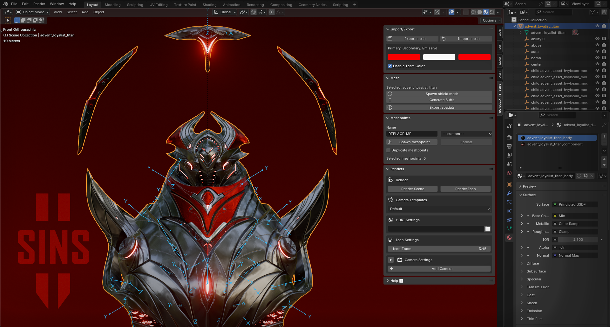

## Blender Extension - Sins of a Solar Empire 2

Makes the modding workflow cozier, with various QoL features to simplify ship rigging along with helpful documentation in the side panel

</img>

## Features
- Automatically corrects blender to game coordinates (Y-up, Z-forward)
- Import/Export to `*.mesh`

## Get started

- Install Blender 4.1.0 or higher: https://www.blender.org/download/
- Download the ZIP: https://github.com/largeBIGsnooze/sins2-blender-extension/archive/master.zip
- Drag and drop the zip archive under `Edit` > `Preferences` > `Add-ons` or manually install it
- The extension menu should then appear in the side panel of the 3D Viewport

## Rendering icons

- Open the `Render` panel
- Select the mesh you want to render
- Load the default template by pressing `Load Default Template` in the `Camera Template` section
    - The default template generates the largest size of hud and tooltip icons used in the game using similar camera settings
    - Select the HDRi you want to use 
        (free space pack: https://www.artstation.com/marketplace/p/LrOD5/free-space-and-nebula-hdri-sci-fi-skydomes)
    - Optional: Tweak the settings to your liking and save templates of your own (saved in `%localappdata%\sins2\sins2-blender-extension\camera_templates.json`)
- Press `Render Scene` to render perspective views
- Press `Render Icon` to render icon (only a basic white silhouette for now)
- Select the folder you want to save the images to

### Render Settings

#### Camera Settings
- **Type**: Perspective or Orthographic camera
- **Clip End**: Maximum view distance
- **F Length/Scale**: Focal length (perspective) or scale (orthographic)
- **Distance**: Camera distance from model center
- **H/V Angle**: Horizontal and vertical camera angles away from the model (0,0 is directly at the front of the model)
- **Tilt**: Tilt camera up or down to get a better view
- **Offset X/Y/Z**: Fine position adjustments

#### Lighting
- **3-Point Lighting**: Key, fill, and back lights for dramatic lighting
  - **Distance**: Overall light positioning
  - **Light Size**: Size of area lights relative to model
  - **Energy**: Individual light intensities
- **Sun Light**: Directional light
  - **Energy**: Sun light intensity
  - **H/V Angle**: Sun direction

#### Render Quality
- **Samples**: Render quality (higher = cleaner but slower)
- **Resolution**: Output image size
- **Background**: Transparent or solid
- **HDRi Strength**: Environment lighting intensity and background image if solid

## Credits
- Stardock and Ironclad for `Meshbuilder.exe` from their modding tools repository

https://github.com/IroncladGames/tools
